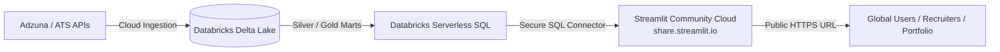

# 100% Free Cloud Deployment Guide: Streamlit Community Cloud

> **Zero Cost Guarantee**: This deployment uses **Streamlit Community Cloud** (hosted directly by Snowflake/Streamlit) connected to your free-tier **Databricks Serverless SQL Warehouse**. No credit card is required, no local computer needs to remain turned on, and hosting is completely free forever.

---

## 1. Cloud Architecture Overview



- **Compute & UI**: Streamlit Community Cloud (1 GB RAM, 1 vCPU, 24/7 HTTPS, automated CI/CD from GitHub).
- **Data Warehouse**: Databricks Serverless SQL Warehouse running Delta Lake tables (`fact_job_posting`, `fact_job_posting_archive`, and all 11 analytical marts).
- **Secrets Management**: Streamlit Cloud Encrypted Secrets (replaces local `.env` securely).

---

## 2. Step-by-Step Deployment Instructions

### Step 1: Commit and Push All Changes to GitHub

From your local terminal, ensure all your latest code, pages, and `requirements.txt` are pushed to your GitHub repository:

```bash
# 1. Check current status
git status

# 2. Stage all modifications and newly created files
git add .

# 3. Commit with a clear release message
git commit -m "feat(deploy): add production Streamlit app, freshers parsing, seasonality mart, and cloud configs"

# 4. Push to origin main
git push origin main
```

> [!NOTE]
> Your `.env` file is in `.gitignore` and will **never** be pushed to GitHub. This keeps your Databricks tokens completely private and safe.

---

### Step 2: Sign In to Streamlit Community Cloud

1. Visit [**share.streamlit.io**](https://share.streamlit.io/).
2. Click **Continue with GitHub** to log in with your GitHub account (`manva-niso`).
3. Authorize Streamlit to access your public repositories.

---

### Step 3: Create and Configure Your App

1. On the Streamlit Cloud dashboard, click the blue **"Create app"** button in the top-right corner.
2. Select **"I already have an app"**.
3. Fill in the deployment form with the following exact values:

| Field | Value | Notes |
| :--- | :--- | :--- |
| **Repository** | `manva-niso/DataWarehouse.` | Select from the dropdown or paste repo name |
| **Branch** | `main` | Default branch |
| **Main file path** | `app/Home.py` | Entry point of your multi-page Streamlit application |
| **App URL (Custom Subdomain)** | `job-market-pulse` *(or any available name)* | Results in `https://job-market-pulse.streamlit.app` |

---

### Step 4: Configure Cloud Secrets (Databricks Connection)

Before launching the app, configure your Databricks credentials so the cloud container can query your Delta Lake warehouse:

1. On the same deployment screen, click **"Advanced settings"** (or if already launched, click the **Settings** gear icon $\rightarrow$ **Secrets**).
2. In the **Secrets** text box, paste the following configuration:

```toml
# Databricks SQL Warehouse Connection
DATABRICKS_HOST = "dbc-a78bfeb4-9761.cloud.databricks.com"
DATABRICKS_HTTP_PATH = "/sql/1.0/warehouses/b8f7d146f81d70bd"
DATABRICKS_TOKEN = "your_databricks_personal_access_token_here"
DATABRICKS_CATALOG = "workspace"
DATABRICKS_SCHEMA = "default"

# Adzuna Extraction Configuration
ADZUNA_APP_ID = "your_adzuna_app_id_here"
ADZUNA_APP_KEY = "your_adzuna_app_key_here"
ADZUNA_QUERY = "data engineer"
ADZUNA_COUNTRY = "in"
ADZUNA_PAGES = "1"
```

3. Click **"Save"**.

---

### Step 5: Click "Deploy!"

1. Click the **"Deploy!"** button.
2. Streamlit Community Cloud will:
   - Spin up a secure Debian Linux container.
   - Install Python 3.12 and dependencies from `requirements.txt`.
   - Mount your secrets securely into memory.
   - Launch your application at your custom URL (e.g., `https://job-market-pulse.streamlit.app`).

---

## 3. What You Get Once Deployed

Your live cloud application is accessible from anywhere in the world without keeping your laptop on:

1. **Overview & Executive KPIs**: Real-time counts of active postings, avg salary, fresher-friendly roles percentage, and top hiring companies.
2. **Browse Job Opportunities**: Search and filter jobs by role category, experience requirement (Freshers vs. Experienced), city, and salary range.
3. **Application Funnel Tracker**: Status tracking of active job applications (Wishlist, Applied, Interview, Offer) with live Excel export download.
4. **Market & Domain Intelligence**: Interactive bar and pie charts analyzing high-demand skills, salary distributions, and domain demand.
5. **Seasonality & Longevity**: Quarterly posting trends, monthly hiring peaks, domain spikes, and posting age analysis.
6. **Data Quality & Warehouse Health**: Automated test results auditing uniqueness, null constraints, and freshness across Delta Lake tables.

---

## 4. Automatic Continuous Deployment (CI/CD)

Whenever you make improvements or changes:
1. Make your code changes locally.
2. Run `git commit -am "your update"` and `git push origin main`.
3. Streamlit Community Cloud will **automatically detect the push** and redeploy your live application within seconds with zero downtime!

---

## 5. Frequently Asked Questions (FAQ)

### Will I be charged anything?
**No.** Streamlit Community Cloud provides 100% free hosting for open-source repositories. Databricks Free / Community Edition is also free.

### What happens when nobody is using the app?
Streamlit Community Cloud puts apps to "sleep" after a few days of inactivity to conserve resources. When any visitor opens the URL, it automatically wakes up in ~10 seconds. You can also click "Wake up app" in 1 click.

### Does my local computer need to be running?
**No.** Once deployed to Streamlit Community Cloud, the app runs entirely on cloud servers. You can shut down your PC, access the app from your mobile phone, or share the link on LinkedIn/resume.
